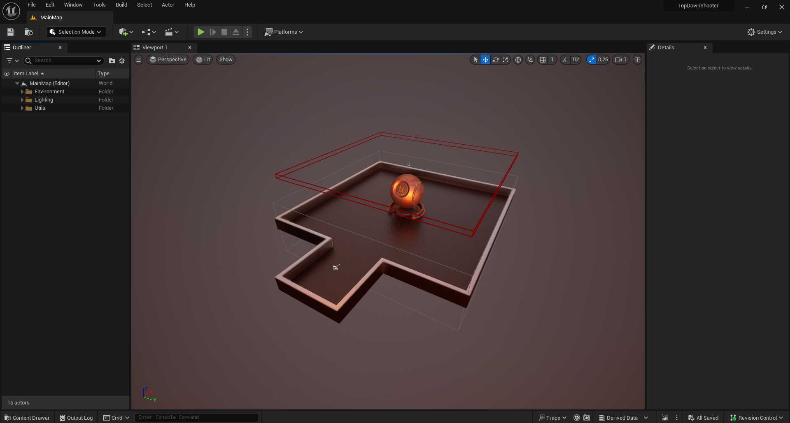
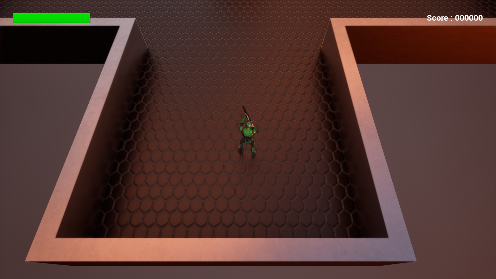
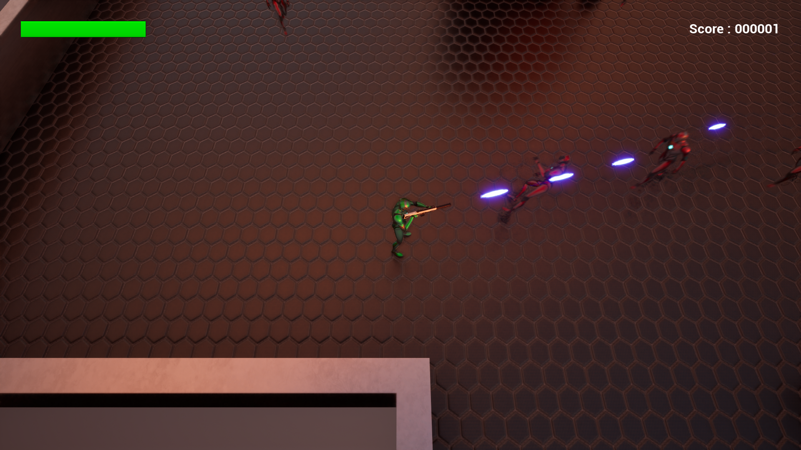
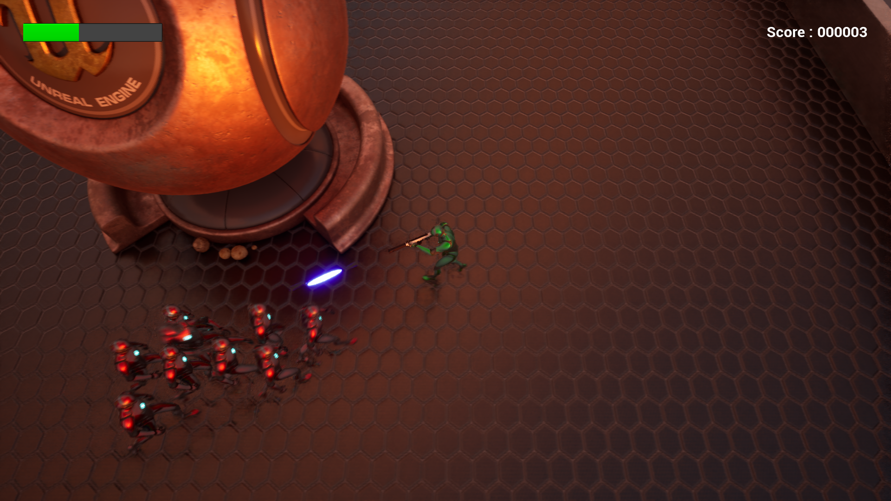

# TopDownShooter

## Overview
TopDownShooter is a 3D top down game, the purpose is to kill the more enemy possible without dying. It's the result of a 12h course made by Gamedev Teacher that I follow to improve my skills in UE5.
> Made in 1 week (Thanks to the formation of Gamedev Teacher at https://www.youtube.com/@GamedevTeacher)

## Table of Contents
- [Features](#features)
- [Technologies Used](#technologies-used)
- [Demo](#demo)
- [License](#license)

## Features

- **Animations & Blend**: Create fluid and seamless character movements through blended animations for a more lifelike and immersive gaming experience.

- **Sounds & Musics**: Enhance the gaming experience with immersive audio elements. Separate sound and music mixing for a well-balanced auditory environment.

- **UI**: Provide a user-friendly interface with essential elements such as a health bar and score display for a clear and informative gaming experience.

## Technologies Used

- **UE5**: UE5 is a powerful and versatile game development engine known for its cutting-edge graphics, realistic physics, and robust game creation tools. It provides an immersive environment for developers to bring their visions to life.

- **Blueprints**: Visual scripting system simplifying game development, enabling rapid prototyping and collaboration.

## Demo

## License

This project is licensed under the MIT License - see the [LICENSE.md](LICENSE.md) file for details.